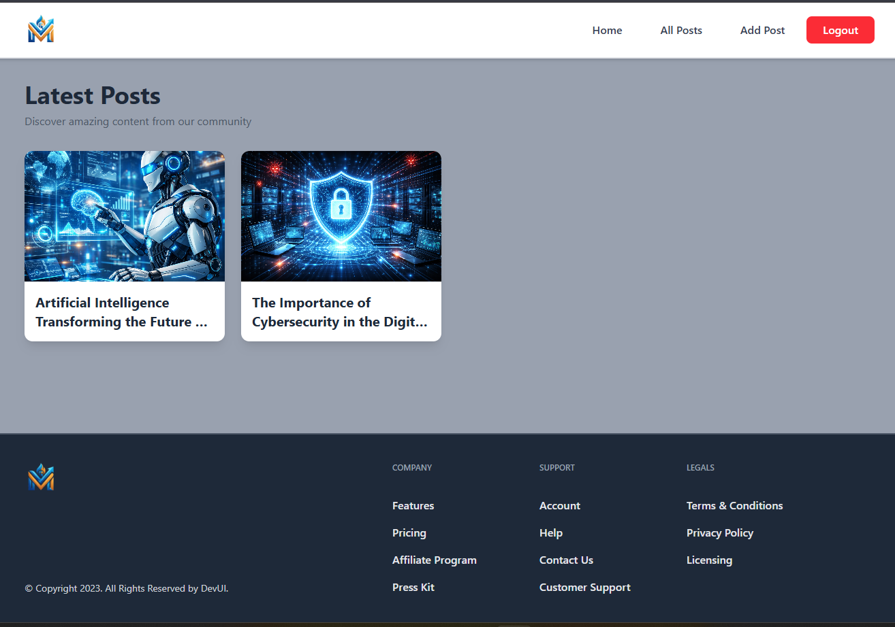

# 📝 MegaBlog - Modern Blogging Platform

<div align="center">


**A feature-rich, full-stack blogging platform with authentication, real-time content management, and modern UI/UX**

##  Live Site - https://mega-blog-smoky-five.vercel.app/
</div>

---

## 🎯 Project Overview

MegaBlog is a production-ready blogging platform that demonstrates modern web development practices and full-stack capabilities. Built with React and powered by Appwrite's Backend-as-a-Service, this application showcases seamless integration of frontend and backend technologies to deliver a smooth user experience.

### 🌟 Key Highlights

- **Full Authentication System** - Secure user registration, login, and session management
- **Rich Text Editor** - TinyMCE integration for professional content creation
- **Image Management** - Upload and manage featured images with cloud storage
- **State Management** - Redux Toolkit for predictable state handling
- **Protected Routes** - Role-based access control and authentication guards
- **Responsive Design** - Mobile-first approach with TailwindCSS
- **Real-time Updates** - Dynamic content rendering and instant feedback


---

## ✨ Features

### 🔐 Authentication & Authorization
- User registration with email validation
- Secure login/logout functionality
- Session persistence and management
- Protected routes with authentication guards
- User-specific content access control

### 📄 Content Management
- Create, read, update, and delete blog posts (CRUD operations)
- Rich text editor with formatting options
- Draft and publish workflow
- Featured image upload and management
- Post status management (active/inactive)

### 🎨 User Interface
- Clean, modern, and intuitive design
- Fully responsive across all devices
- Smooth animations and transitions
- Loading states and error handling
- Empty state designs for better UX

### 🚀 Performance & Optimization
- Fast page loads with Vite's HMR
- Optimized bundle size
- Lazy loading and code splitting
- Efficient state management with Redux

---

## 🛠️ Tech Stack

### Frontend
- **React 19.2.0** - Latest React with modern hooks and features
- **Vite 7.3.1** - Next-generation frontend tooling for blazing-fast development
- **TailwindCSS 4.2.1** - Utility-first CSS framework for rapid UI development
- **React Router DOM 7.13.0** - Declarative routing for React applications
- **Redux Toolkit 2.11.2** - Official, opinionated Redux toolset

### Backend & Services
- **Appwrite 22.3.0** - Open-source Backend-as-a-Service platform
  - Authentication service
  - Database management
  - File storage
  - Real-time APIs

### Additional Libraries
- **TinyMCE React** - Professional rich text editor
- **React Hook Form 7.71.1** - Performant form validation
- **HTML React Parser** - Safe HTML rendering
- **ESLint** - Code quality and consistency


---

## 🏗️ Architecture & Design Patterns

### Component Architecture
- **Modular Components** - Reusable, self-contained UI components
- **Container/Presentational Pattern** - Separation of logic and presentation
- **Higher-Order Components** - AuthLayout for route protection
- **Custom Hooks** - Encapsulated business logic

### State Management
- **Redux Store** - Centralized application state
- **Slice Pattern** - Feature-based state organization
- **Async Thunks** - Handling asynchronous operations

### Code Organization
```
src/
├── appwrite/          # Backend service integration
├── components/        # Reusable UI components
├── pages/            # Route-level components
├── store/            # Redux state management
└── conf/             # Configuration management
```

---

## 🚀 Getting Started

### Prerequisites
- Node.js (v18 or higher)
- npm or yarn
- Appwrite account (free tier available)

### Installation

1. **Clone the repository**
   ```bash
   git clone https://github.com/vadiraj-22/megablog.git
   cd megablog
   ```

2. **Install dependencies**
   ```bash
   npm install
   ```

3. **Configure environment variables**
   
   Create a `.env` file in the root directory:
   ```env
   VITE_APPWRITE_URL=your_appwrite_endpoint
   VITE_APPWRITE_PROJECT_ID=your_project_id
   VITE_APPWRITE_DATABASE_ID=your_database_id
   VITE_APPWRITE_COLLECTION_ID=your_collection_id
   VITE_APPWRITE_BUCKET_ID=your_bucket_id
   ```

4. **Set up Appwrite**
   - Create a new project in Appwrite
   - Set up a database and collection with the following attributes:
     - `title` (string)
     - `content` (string)
     - `featuredImage` (string)
     - `status` (string)
     - `userId` (string)
   - Create a storage bucket for images
   - Configure authentication methods

5. **Start the development server**
   ```bash
   npm run dev
   ```

6. **Build for production**
   ```bash
   npm run build
   ```


---

## 📸 Screenshots

### Home Page


### All Posts


### Login Page


---

## 🎓 What I Learned

This project demonstrates proficiency in:

- **Full-Stack Development** - Integrating frontend with backend services
- **Modern React Patterns** - Hooks, context, and component composition
- **State Management** - Complex state handling with Redux Toolkit
- **Authentication Flow** - Implementing secure user authentication
- **API Integration** - Working with RESTful APIs and SDKs
- **Form Handling** - Advanced form validation and submission
- **File Upload** - Managing file uploads and cloud storage
- **Responsive Design** - Creating mobile-first, accessible interfaces
- **Code Quality** - Following best practices and maintaining clean code

---

## 🔮 Future Enhancements

- [ ] Comment system for posts
- [ ] User profiles and avatars
- [ ] Post categories and tags
- [ ] Search and filter functionality
- [ ] Social sharing integration
- [ ] Markdown support
- [ ] Dark mode toggle
- [ ] Email notifications
- [ ] Analytics dashboard
- [ ] SEO optimization

---

## 🤝 Contributing

Contributions, issues, and feature requests are welcome! Feel free to check the [issues page](#).

1. Fork the project
2. Create your feature branch (`git checkout -b feature/AmazingFeature`)
3. Commit your changes (`git commit -m 'Add some AmazingFeature'`)
4. Push to the branch (`git push origin feature/AmazingFeature`)
5. Open a Pull Request

---

## 📝 License

This project is open source and available under the [MIT License](LICENSE).

---

## 👨‍💻 Author

**Vadiraj Joshi**

- GitHub: [@vadiraj-22](https://github.com/vadiraj-22)
- LinkedIn: [Vadiraj Joshi](https://www.linkedin.com/in/vadiraj-joshi220504/)
- Portfolio: [vadiraj-joshi.com](https://portfolio-jk7i.onrender.com/)

---

## 🙏 Acknowledgments

- [Appwrite](https://appwrite.io/) for the excellent BaaS platform
- [TailwindCSS](https://tailwindcss.com/) for the utility-first CSS framework
- [Vite](https://vitejs.dev/) for the amazing build tool
- [React](https://react.dev/) for the powerful UI library

---

<div align="center">

**⭐ Star this repository if you found it helpful!**

Made with ❤️ and React

</div>
